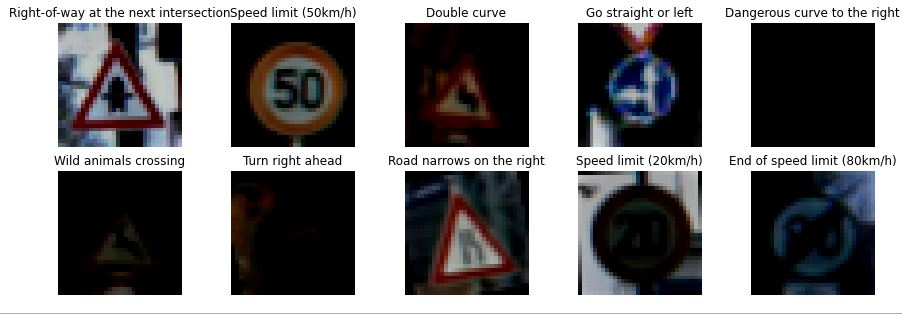

Traffic Sign Classification using CNN
===

## Table of contents
* [About](#about)
* [Dataset](#dataset)
* [Results](#results)
* [Libraries](#libraries)

## About
<b>Motivation</b> - To display my interest in image recognition, especially for practical applications of machine learning using realistic data. This project's application of Computer Vision is also tied to machine learning in self-driving cars, or more generally, autonomous vehicles, as vehicles that are able to recognize these road signs will be able to gain important information about the road up ahead, for example it may tell it to stick to a particular speed limit, or be extra wary of cars from certain directions.

A focus of this project is to create a versatile classifier, using a CNN, with the ability to accurately recognize and predict types of traffic signs from small images in low lighting (at night, obscured in shadow) and low quality (blurred, low resolution).
Then I perform visual comparison of different models with various filter dimensions on training and validation sets to determine the best model.

## Dataset
The dataset used for this project was obtained from a [popular Kaggle dataset for the German Traffic Sign Recognition Benchmark (GTSRB) challenge](https://www.kaggle.com/meowmeowmeowmeowmeow/gtsrb-german-traffic-sign) 
The dataset consists of:
* 86,989 (~87,000) images in the training set
* 12,630 images in the test set
* ratio of training:test size is 87%
* Images are of size 32x32
* 43 different types of traffic signs

### Visualization of data
Notice that many of the images displaying the traffic signs are blurry, partially obscured, and dimly-lit. These features permeate through the many images in this dataset and is the main reason I chose this particular dataset - it is very realistic and thus the resulting model trained on this data is very applicable in real-world scenarios.

## Results
### Training and Validation Accuracy comparison between different models
From this we can observe that after 10 epochs, most of the models achieved near perfect accuracy for the training set images and there is a relatively small difference in performance between all the various models, whereas we see a more pronounced difference in their validation accuracies. Importantly, we can observe that the model with the **5x5 filter**, attained the highest Training Accuracy (99.08%) as well as the highest Validation Accuracy (86.10%) at the end of 10 epochs. 

*Note that the 3x3 filter obtained the second highest Training Accuracy (99.04%) and, at one point, between 3 and 5 epochs, achieved the highest Validation Accuracy between all models, though other models overtook it from this point.*

The predictions below are from this best model (5x5 filter)

### Predictions with Best Model (images from test set)
The following shows the predicted label by the best model (chosen from the comparison above), as well as the true label below it. As you can see, the predictions are all correct for this set of images! This result matches the high accuracy that was observed for the training and validation sets (see above graph)

## Libraries
* tensorflow
* keras
* pandas
* numpy
* matplotlib
